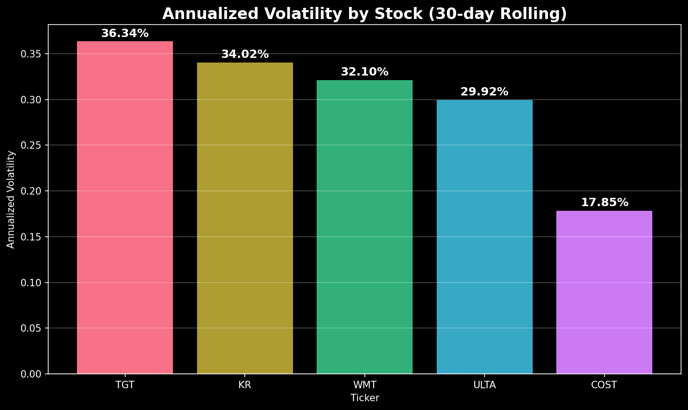
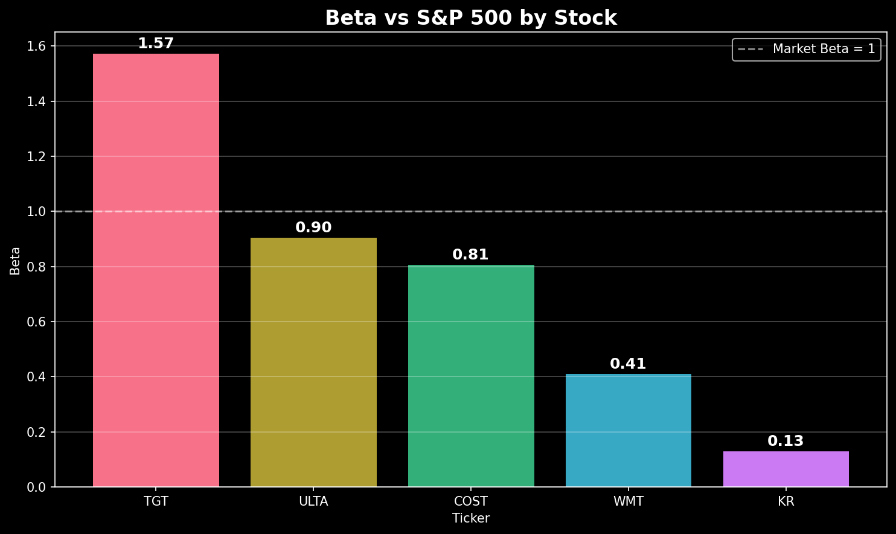
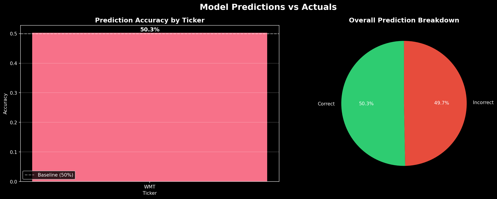
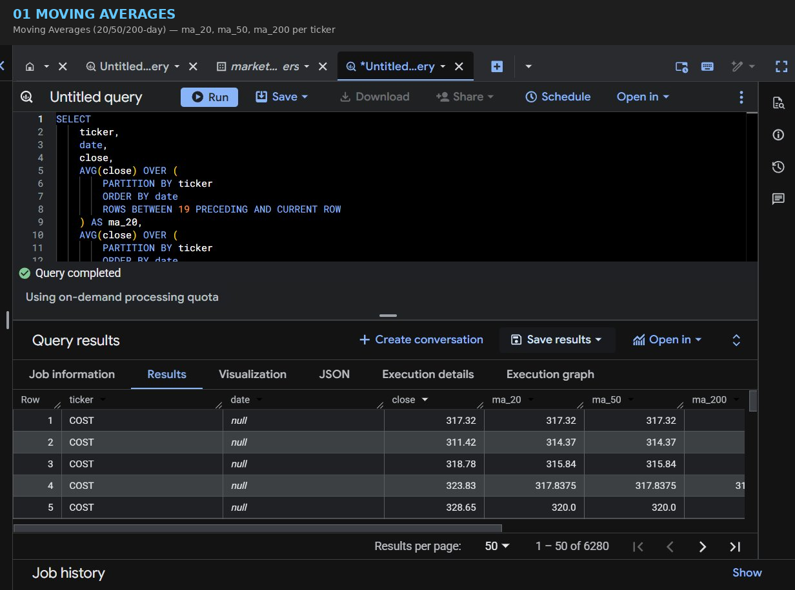
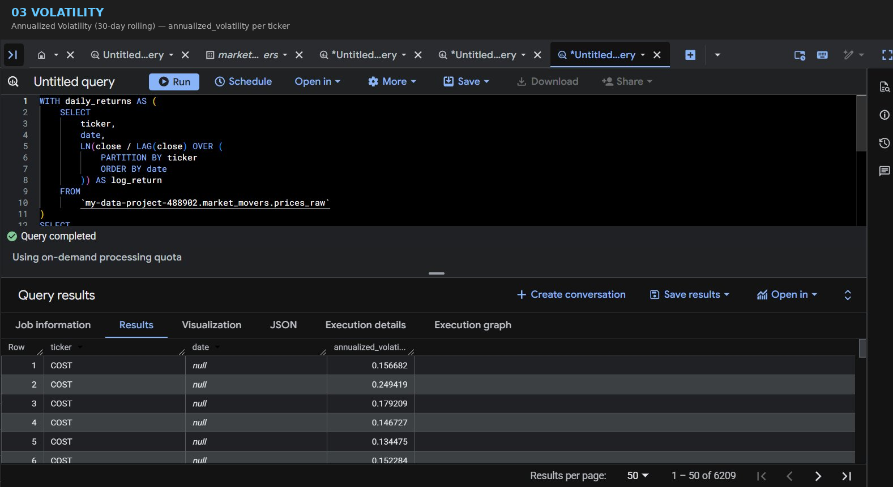
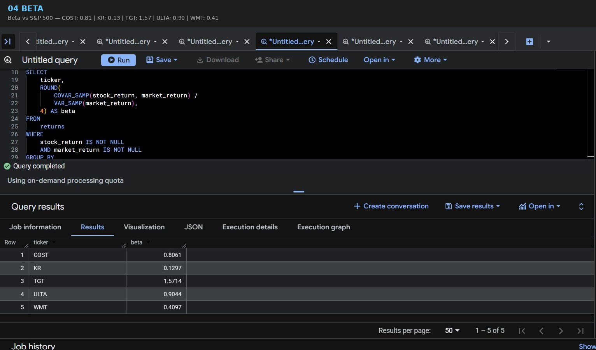
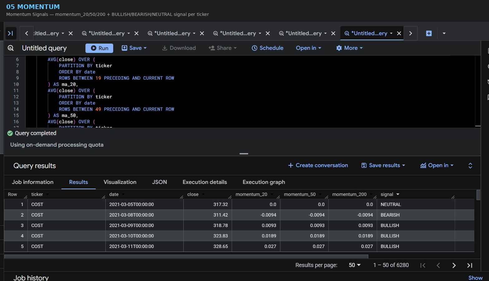

# Retail Stock Market Analyzer

A full end-to-end data pipeline and machine learning project analyzing 5 years of historical stock data across five major retail companies using Python, SQL, BigQuery, and Google Cloud Platform.

## Companies Analyzed
| Ticker | Company | Sector |
|--------|---------|--------|
| TGT | Target | Consumer Defensive |
| WMT | Walmart | Consumer Defensive |
| COST | Costco | Consumer Defensive |
| KR | Kroger | Consumer Defensive |
| ULTA | Ulta Beauty | Consumer Cyclical |

## Tech Stack
- **Python** — data ingestion, feature engineering, ML modeling
- **BigQuery** — cloud data warehouse for all analytics
- **Google Cloud Platform** — project hosting and IAM
- **scikit-learn** — Random Forest classifier
- **Jupyter** — analysis and visualization
- **Git/GitHub** — version control

## Project Structure
```
02_Retail_Stock_BigQuery_Analysis/
├── bigquery_sql/
│   ├── 01_moving_averages.sql
│   ├── 02_daily_returns.sql
│   ├── 03_volatility.sql
│   ├── 04_beta.sql
│   └── 05_momentum.sql
├── notebooks/
│   └── analysis.ipynb
├── images/
│   ├── 01_price_history.png
│   ├── 02_moving_averages.png
│   ├── 03_volatility.png
│   ├── 04_beta.png
│   └── 05_predictions.png
├── models/
│   └── random_forest.pkl
├── load_to_bigquery.py
├── feature_engineering.py
└── train_model.py
```

## Pipeline Overview
1. **Data Ingestion** — Downloaded 5 years of OHLCV data from Yahoo Finance and loaded into BigQuery using Python
2. **SQL Analytics** — Wrote 5 SQL files using window functions to calculate moving averages, daily returns, volatility, beta, and momentum signals
3. **Feature Engineering** — Built ML-ready features in Python including rolling statistics, momentum indicators, and a binary target variable
4. **Model Training** — Trained a Random Forest classifier to predict daily price direction
5. **Visualization** — Built charts in Jupyter notebook showing price history, moving averages, volatility, beta, and predictions vs actuals

## BigQuery Tables
| Table | Description | Rows |
|-------|-------------|------|
| `prices_raw` | Daily OHLCV data for all 5 stocks | 6,280 |
| `index_prices` | S&P 500 (SPY) daily prices | 1,256 |
| `companies` | Company metadata | 5 |
| `features` | Engineered ML features | 5,008 |
| `predictions` | Model predictions vs actuals | 1,002 |

## Key Findings
- **TGT** has the highest beta (1.57) — most sensitive to market movements
- **KR** has the lowest beta (0.13) — very defensive, barely correlated with S&P 500
- **COST** has the lowest volatility (17.85%) — most stable of the five
- **TGT** has the highest volatility (36.34%) — most risk
- Model achieved 50.3% accuracy — consistent with the difficulty of short-term price prediction

## SQL Analytics Screenshots
### Moving Averages


### Daily Returns


### Volatility


### Beta vs S&P 500


### Momentum Signals


## BigQuery SQL Results

### Moving Averages


### Daily Returns


### Volatility


### Beta vs S&P 500


### Momentum Signals
